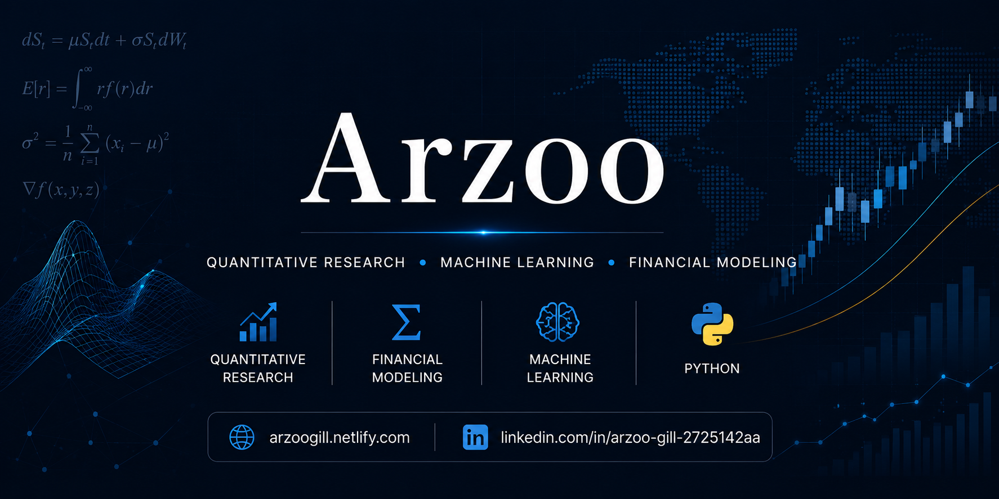

  

  Mathematics & Scientific Computing @ IIIT Gwalior

  <b>Quantitative Research • Machine Learning • Financial Modeling • Python</b>

  <a href="https://arzoogill.netlify.com">Portfolio</a> •
  <a href="https://www.linkedin.com/in/arzoo-gill-2725142aa">LinkedIn</a>

---

## About Me

I'm a Mathematics & Scientific Computing student at IIIT Gwalior interested in quantitative research, financial markets, machine learning, and data-driven problem solving.

I enjoy working with mathematical models, financial time-series, statistical methods, and machine learning to turn quantitative ideas into practical systems.

*  Interested in Quantitative Research & Financial Modeling
*  Exploring Machine Learning and Data Science
*  Building research-oriented projects using Python
*  Practicing Data Structures & Algorithms
*  Interested in statistical modeling and time-series analysis

---

## Experience

### Financial Market Analyst Intern — Futures First

Worked on a quantitative research platform focused on statistical arbitrage and cointegration analysis.

* Developed a research workflow for identifying statistically suitable asset pairs
* Worked with stationarity, mean reversion, and cointegration analysis
* Implemented Engle–Granger and Johansen cointegration methods
* Used rolling-window analysis and hedge-ratio estimation
* Built an interactive research dashboard using Python and Flask
* Worked with financial time-series data using Pandas and Statsmodels

---

## Featured Projects

### Quantitative Cointegration Dashboard

An interactive quantitative research platform for discovering and evaluating statistically suitable pairs for statistical arbitrage.

**Key Work:** Stationarity • Mean Reversion • Engle–Granger • Johansen • Rolling Analysis • Hedge Ratios

**Tech:** Python • Pandas • Statsmodels • Flask • JavaScript

### OptionLab

A quantitative finance project focused on options analysis, financial modeling, and quantitative decision-making.

**Focus:** Options • Quantitative Finance • Financial Modeling • Python

### Stock Direction Forecasting

A machine-learning project for predicting stock price direction using historical market data and engineered financial features.

**Focus:** Machine Learning • Time Series • Feature Engineering • Financial Data

### Project Rakshak

An AI-driven project exploring machine learning, anomaly detection, and data-driven approaches for public safety and fraud detection.

**Focus:** AI/ML • Anomaly Detection • Data Analysis

---

## Technical Skills

### Programming
`Python` `C++` `SQL`

### Data & Visualization
`Pandas` `NumPy` `Matplotlib`

### Machine Learning
`PyTorch` `XGBoost` `Random Forest`

### Quantitative & Statistical Methods
`Probability` `Hypothesis Testing` `Regression` `Time Series Analysis`  
`Stationarity` `Cointegration` `Constrained Optimization`

### Development & Tools
`Flask` `Git` `PyTest`

---

## Education

**Indian Institute of Information Technology and Management, Gwalior**

B.Tech — Mathematics & Scientific Computing
2023 – 2027

---

## Currently Exploring

* Quantitative Research
* Statistical Arbitrage
* Financial Time-Series
* Machine Learning
* Mathematical Modeling
* Data Structures & Algorithms

---

## Connect With Me

  <a href="https://arzoogill.netlify.com">🌐 Portfolio</a> •
  <a href="https://www.linkedin.com/in/arzoo-gill-2725142aa">💼 LinkedIn</a>

